# Random Name Generator and Saver on Amazon EKS

## Project Overview

This project demonstrates a complete CI/CD pipeline for deploying a containerized Node.js application to Amazon Elastic Kubernetes Service (EKS).

The application generates random names, stores them in a MongoDB database, and displays all saved names through a web interface.

The infrastructure includes Amazon EKS Auto Mode, Amazon ECR, GitHub Actions, a Network Load Balancer (NLB), MongoDB StatefulSet with persistent storage, and Kubernetes manifests.

---

## Architecture


---

## Technologies Used

- Amazon Web Services (AWS)
- Amazon EKS (Auto Mode)
- Amazon ECR
- Amazon EBS
- Network Load Balancer (NLB)
- Kubernetes
- Docker
- GitHub Actions
- Node.js
- MongoDB 3.6
- eksctl

---

## Project Structure

```
.
├── .github/
│   └── workflows/
│       └── deploy.yml
│
├── diagram/
│   ├── architecture.drawio
│   └── architecture.png
│
├── eksctl/
│   └── cluster.yaml
│
├── k8s/
│   ├── namespace.yaml
│   ├── storageclass.yaml
│   ├── mongodb-secret.yaml
│   ├── mongodb-service.yaml
│   ├── mongodb-init-configmap.yaml
│   ├── mongodb-statefulset.yaml
│   ├── app-deployment.yaml
│   └── app-service.yaml
│
├── screenshots/
│
├── Dockerfile
├── package.json
├── README.md
└── ...
```

---

## Infrastructure

The Kubernetes cluster was provisioned using **eksctl** with **Amazon EKS Auto Mode**.

Resources deployed:

- Amazon EKS Cluster
- Amazon ECR Repository
- Amazon EBS Persistent Volume
- Kubernetes Namespace
- MongoDB StatefulSet
- Node.js Deployment
- Kubernetes Services
- Network Load Balancer

---

## Kubernetes Resources

### Application

- Deployment
- 2 Replicas
- LoadBalancer Service

### Database

- MongoDB 3.6
- StatefulSet
- Persistent Volume Claim
- Amazon EBS Storage

---

## CI/CD Pipeline

The project uses GitHub Actions for Continuous Integration and Continuous Deployment.

Pipeline workflow:

1. Developer pushes code to GitHub.
2. GitHub Actions starts automatically.
3. Docker image is built.
4. Image is pushed to Amazon ECR.
5. kubectl connects to Amazon EKS.
6. Deployment image is updated.
7. Kubernetes performs a rolling update.

The workflow authenticates to AWS using GitHub OIDC without storing long-term AWS credentials.

---

## Deployment

Provision the cluster:

```bash
eksctl create cluster -f eksctl/cluster.yaml
```

Deploy Kubernetes resources:

```bash
kubectl apply -f k8s/
```

Verify resources:

```bash
kubectl get pods -n namegen
kubectl get svc -n namegen
kubectl get pvc -n namegen
```

---

## Screenshots

### Amazon EKS

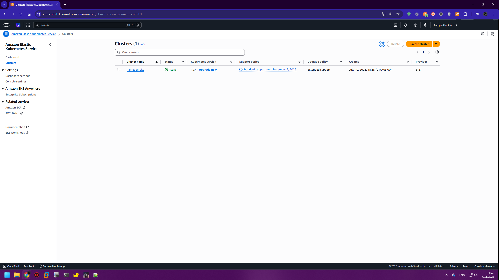

### Kubernetes Nodes

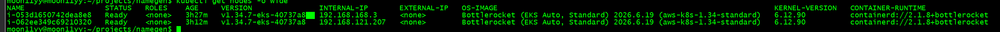

### Running Pods

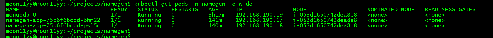

### Kubernetes Services

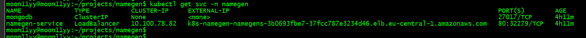

### Persistent Volumes

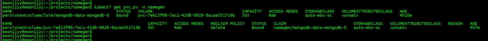

### Amazon EBS

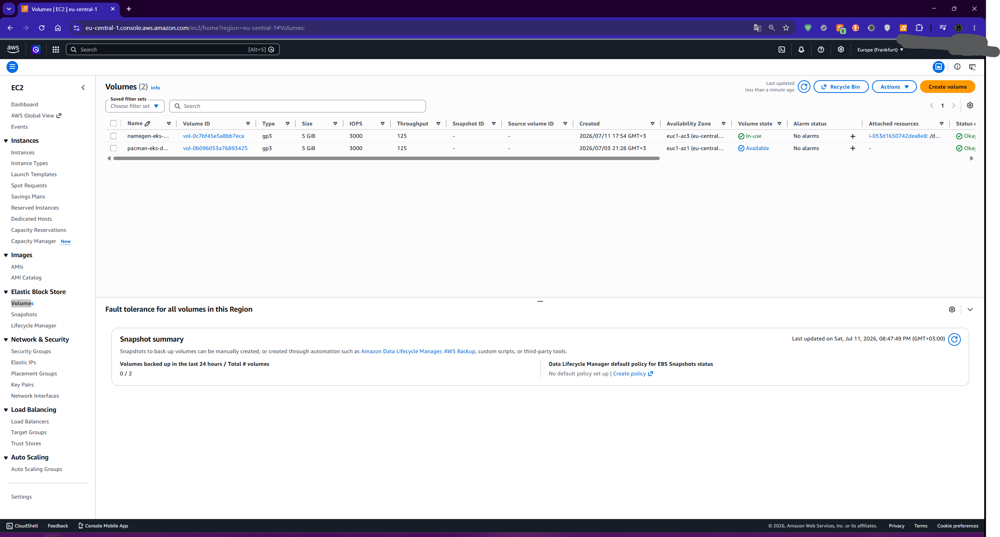

### Network Load Balancer

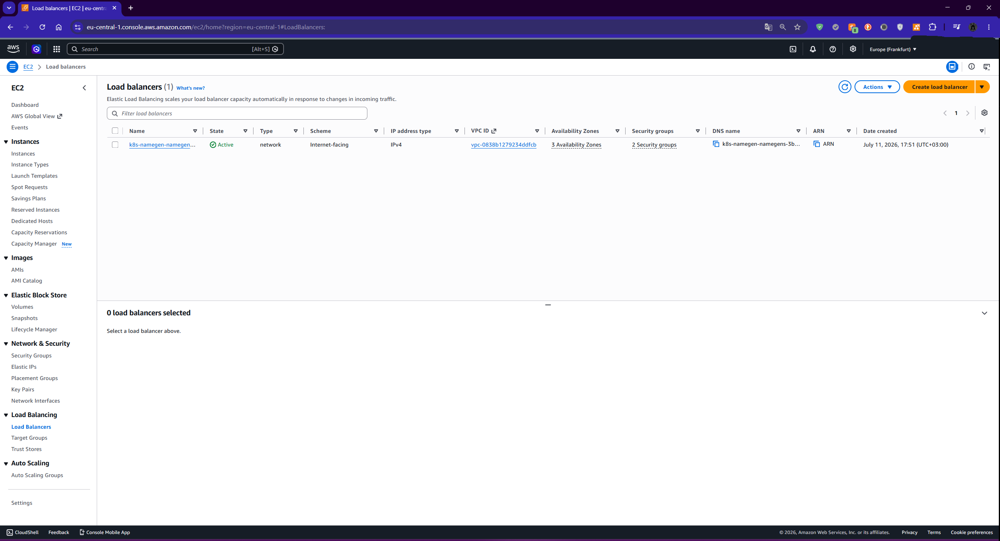

### Amazon ECR

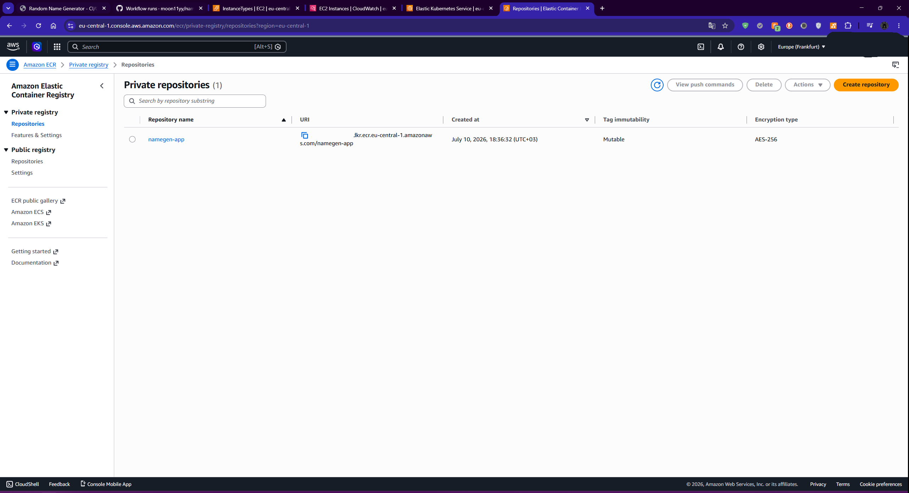

### GitHub Actions Workflow

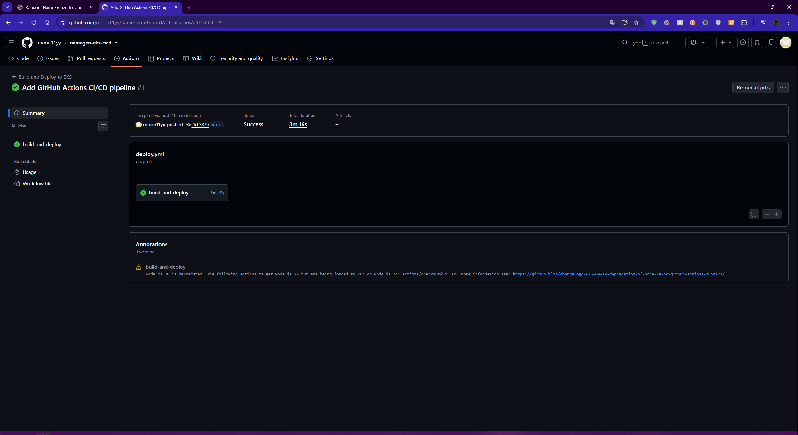

### Successful Deployment

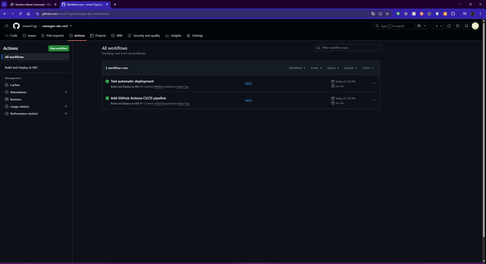

### Running Application

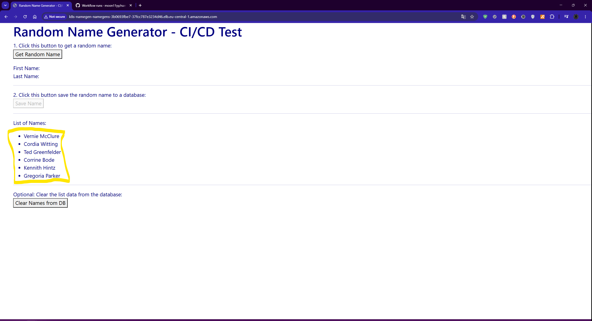

---

## Features

- Fully containerized application
- Automated CI/CD pipeline
- Kubernetes rolling updates
- Persistent MongoDB storage
- Network Load Balancer exposure
- GitHub OIDC authentication
- Infrastructure deployed on Amazon EKS Auto Mode

---

## Result

The application is automatically built and deployed after every push to the **main** branch.

The deployment includes:

- Amazon EKS
- Amazon ECR
- Amazon EBS
- MongoDB StatefulSet
- Kubernetes LoadBalancer Service
- GitHub Actions CI/CD

The application is accessible through an AWS Network Load Balancer and stores data persistently using Amazon EBS.
